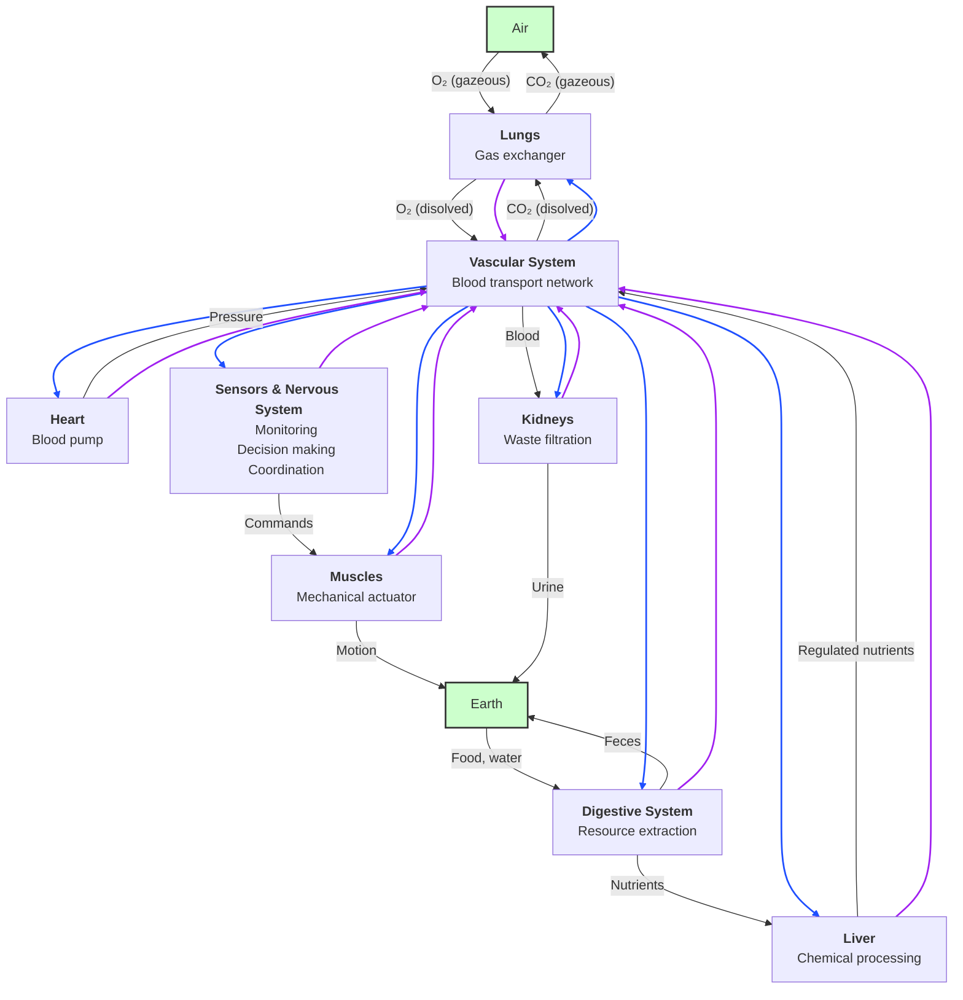
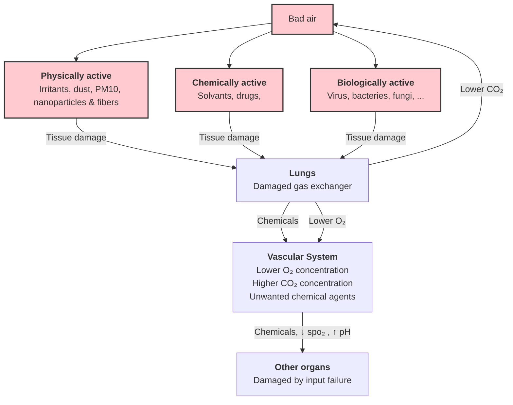
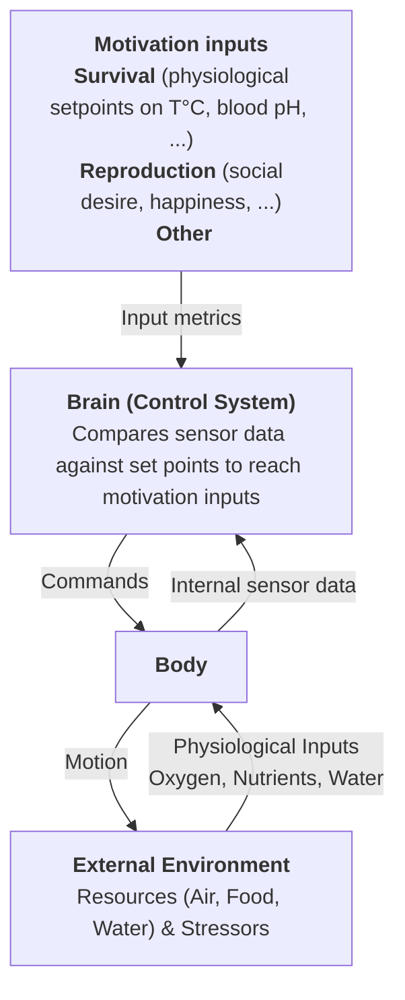

## The starting point
If you were to improve healthcare pathways, what would you do? Trying to dig into this question, I realized I needed to better understand where does sickness comes from. How do you become ill? Or for an engineer like me that stopped biology at age 18, where and at what point does the machine breaks and how not to break it?

## Classification of diseases
The classification of disease is not trivial at all : a whole branch of medical science is dedicated to this topic : Nosology [1](#ref-1). I discovered that people are actually researching theoretical phd thesis on the classification of diseases [2](#ref-2), or for eg doing some clustering on large datasets (UK Biobank for eg) to research better classifications [3](#ref-3)!
In short, it seems there are multiple ways to classify diseases : by cause (etiology), by pathogenesis, by symptoms, by organs involved... 
In our case our objective is prepare a reflexion on preventive actions to avoid breaking the machine. This objective requires identification of causes or pathogenesis of diseases, therefore in this work we will prefer focusing on the classification on causes first and pathogenesis if needed.
But hey wait, <b>what can break?</b>

### The self-maintaining machine
Lets consider the corps as a self-maintaining machine that converts environmental resources (air, water, food) into useful work while continuously regulating itself through feedback control, and represent this with a good old block diagram. It is very simplified and a lot is lacking, but it gives an overview of the whole picture. Basically all cells needs O2 and nutrients to function (blue arrows) and produce CO2 and metabolic waste that need to be processed (violet arrows). 

Not represented here, the immune system could be also added as a block needing O2 and nutrients to detect and fight against the presence of an harmful agent.
We have now a basic overview of what can break, now the following question : <b>how can it break?</b>

### The reliability engineer disease classification
If the body can be viewed as a machine, maybe some concepts in reliability engineering [4](#ref-4) could be reused here? Lets then join the party and add some noise to the nosology field by adding a new classification ! 
Diseases could then be classified as a design-induced (eg hereditary disease), manufacturing-induced (eg cancer), operational-induced (eg respiratory insufficiency due to smoking), environmental-induced diseases (eg infectious diseases).
#### Design- and manufacturing-induced diseases
Design-induced and manufacturing-induced diseases concerns DNA or complex biological processes at the cell level where the patient has a low potential for action, for example genetic diseases or some cancers (5-10% of cancers are due to inherited genetic defects<a href="#ref-5">[5]</a>). The management of these diseases saw pretty big advances past years with the developments of gene therapy [6](#ref-6) and immmunotherapy [7](#ref-7). New technologies such as mRNA personalized vaccines [8](#ref-8), antibody-drug conjugates [9](#ref-9), CAR-NK cell therapy [10](#ref-10) are continuing the path to treating more and more cancers. For these cases preventing actions seems to be the early detection of gene defects at the earliest stage of life possible, and earliest treatment if possible using validated gene therapy or immunotherapy. This poses subsequent moral and ethical questions as this concerns the very early stage of life and is connected to gametic selection. Is it more acceptable to select gametes, do gene editing on gametes or on embryo ? This topic is too vast and complex for our present work and feels a bit too far away from where we are today, so lets concentrate on operational-induced and environmental-induced diseases.

#### Operational- and environmental-induced diseases
 Operational induced diseases could regroup disease that can be caused by consented exposition to risk factors such as not doing physical activity, eating bad food, breathing bad air (smoking). Environmental-induced diseases could regroup diseases that are caused by non consented exposition to harmful agents such as viral infections, air pollution, radioactivity.
But hey these are just intuitions, can we take a more quantitative approach to to map the main reasons how the machine can break? What are the common risk factors known in the literature for main diseases?

### Risk factors
Common risk factors for major noncommunicable disease [11](#ref-11), [12](#ref-12) are dietary pattern, physical activity, smoking, air pollution, high blood pressure, obesity, depression, high cholesterol, excess alcohol consumption. Wait, could we reorganize the list please as it seems that there are some overlapping here? For example smoking and air pollution are both breathing bad air. From an engineering point of view, it seems that these risk factors can be grouped as out of specs input problems and inappropriate commands problems.

### Out of specification inputs
Basically there are only two main inputs for the body (skin left appart for simplicity) : the air we breathe and the food and liquid we ingest.

Bad air leads to a damaged gaz exchanger reducing the ability to input O2 to the body and output CO2 to the air (decreasing pH in the blood), and can leads to unwanted chemicals circulating in the body. The change in the composition of the blood can then damage the function of other organs and cells of the body due to out of specification inputs.
The same apply to food and water where physically, chemically or biologically active agents can affect the digestive system and the other organs through diffusion through the body.
Agents can also attack the skin barrier (UV), or diffuse through the body (temperature, pressure, radioactivity).

### Inappropriate commands

Body failure can happen when the brain consigns an effort past its physical capability. At first we can think this can happen driven by adrenaline for example during competitions such as in strain injuries [13](#ref-13). But more generally this can happen when the brain overestimate the state of its physical capability. This is where it links with keeping a good level of physical activity because if not use organs will degrade and will not be able to handle variations that can occur due to infections, change of habits, unexpected external event and will then break. This is where it links with mental health as level of activity is linked to the ability of the human to stay active and keep motivation for surviving. Another motivation could be motivation to reproduce. After physiological needs that keep the body homeostasis, meaning optimal functioning [14](#ref-14).

## State of the art
Of course all of these above discussions are very simplified, looking at the literature in 1972 Guyton authored a large-scale causal diagram showing interacting physiological control loops of the body [15](#ref-15).

Figure : Systems analysis diagram for regulation of the circulation, from Guyton 1972 [15](#ref-15)

This approach has been further developped from 150 variables up to 10,000 variables describing cardiovascular, renal, neural, respiratory, endocrine and metabolic relationships within and across multiple organ systems in the body, providing a time-dependent simulation of human physiology [16](#ref-16), [17](#ref-17). It is freely downloadable at http://hummod.org/. 

More recently, the field of Network Physiology has emerged to address how physiological systems synchronize and integrate their dynamics as a network to optimize functions and to maintain health [18](#ref-18). 
One limitation of this field is the lack of representation for cognition, motivation, immune regulation. Systems medicine is an interdisciplinary field of study that looks at the systems of the human body as part of an integrated whole, incorporating biochemical, physiological, and environment interactions [19](#ref-19). But for now, it seems that no single canonical figure has yet integrated psychology to physiology in a high level yet precise representation of the body.

# Summary

The body could be viewed as a self-maintaining machine with inputs, outputs and a control system. Failure can come from several parts and has several implications. Exposition to harmful physically, chemically or biologically active agents can generate operational-induced (consented exposition) or environmental-induced (non consented exposition) diseases. Harmful agents can penetrates the body through air, food, water, skin. Organs and other systems of the body can break with out of specification inputs (toxic chemicals, wrong concentration, nano/micro-particles) or inappropriate commands in comparison to system capabilities (sensor misfunction). Hereditary or acquired DNA anomalies can lead to design-induced and manufacturing-induced diseases.
Lack of motivation for survival or reproduction can lead to consented exposition to harmful agents, lack of physical activity that will in turns lead to diseases with the decrease of system capabilities increasing the risk for inappropriate commands.

# Bibliography

<strong>[1]</strong> https://en.wikipedia.org/wiki/Nosology

<strong>[2]</strong> Smart, Benjamin. "On the classification of diseases." Theoretical Medicine and Bioethics 35.4 (2014): 251-269.

<strong>[3]</strong> Webster, Albert J., et al. "Characterisation, identification, clustering, and classification of disease." Scientific Reports 11.1 (2021): 5405.

<strong>[4]</strong> https://en.wikipedia.org/wiki/Reliability_engineering

<strong>[5]</strong> https://en.wikipedia.org/wiki/Cancer

<strong>[6]</strong> https://en.wikipedia.org/wiki/Gene_therapy

<strong>[7]</strong> https://en.wikipedia.org/wiki/Immunotherapy

<strong>[8]</strong> Garg, Pankaj, Ravi Salgia, and Sharad S. Singhal. "mRNA-based cancer vaccines: A new frontier in personalized immunotherapy." Biochimica et Biophysica Acta (BBA)-Reviews on Cancer (2026): 189577.

<strong>[9]</strong> Khongorzul, Puregmaa, et al. "Antibody–drug conjugates: a comprehensive review." Molecular Cancer Research 18.1 (2020): 3-19.

<strong>[10]</strong> Balkhi, Sahar, et al. "CAR-NK cell therapy: promise and challenges in solid tumors." Frontiers in Immunology 16 (2025): 1574742.

<strong>[11]</strong> Peters, Ruth, et al. "Common risk factors for major noncommunicable disease, a systematic overview of reviews and commentary: the implied potential for targeted risk reduction." Therapeutic advances in chronic disease 10 (2019): 2040622319880392.

<strong>[12]</strong> World Health Organization. Global health risks: mortality and burden of disease attributable to selected major risks. World Health Organization, 2009.

<strong>[13]</strong> https://en.wikipedia.org/wiki/Strain_(injury)

<strong>[14]</strong> https://en.wikipedia.org/wiki/Homeostasis

<strong>[15]</strong> Guyton, Arthur C., Thomas G. Coleman, and Harris J. Granger. "Circulation: overall regulation." Annual review of physiology 34.1 (1972): 13-44.

<strong>[16]</strong> Hester, Robert L., et al. "Systems biology and integrative physiological modelling." The Journal of physiology 589.5 (2011): 1053-1060.

<strong>[17]</strong> https://hummod.org/

<strong>[18]</strong> Ivanov, Plamen Ch. "The new field of network physiology: building the human physiolome." Frontiers in network physiology 1 (2021): 711778.

<strong>[19]</strong> https://en.wikipedia.org/wiki/Personalized_medicine
